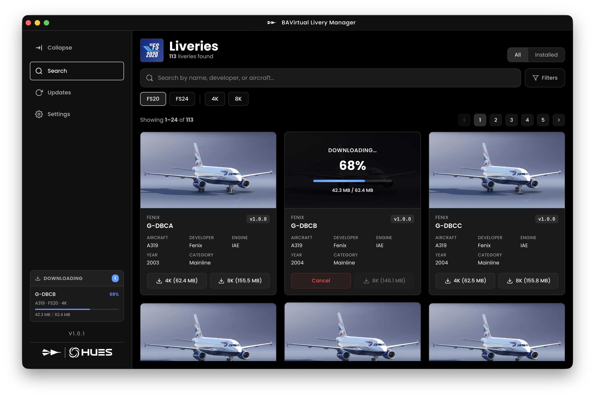

# BAV Livery Manager

A desktop utility that helps **BAV (British Airways Virtual)** pilots install, update, and manage aircraft liveries in a few clicks.

---

## ✨ Features

- Browse the full list of available BAV liveries
- Install liveries into Microsoft Flight Simulator  
- Detect installed liveries and compare versions  
- Update outdated liveries with one click  
- Lightweight Electron-based UI

---

## 📦 Installation

1. Go to the **[Releases](https://github.com/p-sergienko/bav-livery-manager/releases)** section.  
2. Download the latest version.  
3. Run the installer.  

---

## 🛠 Usage

1. Launch the application.  
2. Set the MSFS Community folder path if it is not detected automatically.  
3. Select any livery from the list.  
4. Press **Install** to add it to your simulator.

The app automatically checks versions and notifies you when updates are available.

